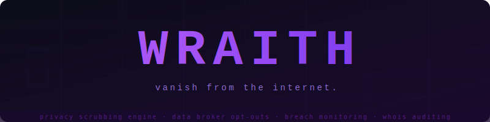

<div align="center">
  
</div>

<div align="center">

[](https://www.python.org/)
[](LICENSE)
[](https://playwright.dev/)
[]()

**Take back control of your data.**

</div>

---

Wraith is a command-line privacy engine that automates the tedious process of removing your personal information from the internet. It handles data broker opt-outs via browser automation, monitors for breach exposure, audits domain WHOIS privacy, and tracks the 90-day re-submission cycle so you don't have to.

```
$ wraith scrub --all

 Scrubbing 13 data brokers...

 ✓  FastPeopleSearch    submitted
 ✓  BeenVerified        submitted
 ✓  Spokeo              submitted
 ✓  Intelius            submitted
 ✓  PeopleFinder        submitted
 ✓  TruthFinder         submitted
 ✓  ThatsThem           submitted
 ✓  CheckPeople         submitted
 ✓  USPhoneBook         submitted
 ✓  InstantCheckMate    submitted
 ⚠  Whitepages          manual required — phone verification needed
 ⚠  MyLife              manual required — see instructions
 ✓  Radaris             submitted

 13/13 brokers processed · 11 submitted · 2 manual required
 Next rescan: 2026-06-16
```

---

## Features

- **🕵️ Browser automation** — Playwright navigates opt-out forms automatically so you don't have to
- **📊 State tracking** — SQLite database tracks every submission: pending, confirmed, failed, manual
- **🔄 90-day cycle** — `wraith rescan` resubmits automatically when brokers are due (they re-add you)
- **🔐 Breach monitoring** — Checks all your emails against HaveIBeenPwned v3
- **🌐 WHOIS auditing** — Flags domains where your real contact info is publicly visible
- **🔍 Google removal** — Generates pre-filled checklists for content removal, personal info requests, and Street View blur
- **🎭 Dry run mode** — `--dry-run` navigates without submitting, for verification
- **🔒 Privacy-first** — Profile data never appears in logs; masked output only (`P***e C***k`)

---

## Brokers Covered

| Broker | Method | Auto? |
|--------|--------|-------|
| FastPeopleSearch | Form + email verify | ✅ (pauses for email) |
| BeenVerified | Form + email | ✅ |
| Spokeo | URL opt-out + email | ✅ |
| Intelius | Form + email | ✅ |
| PeopleFinder | Email form | ✅ |
| TruthFinder | Email form | ✅ |
| InstantCheckMate | Email form | ✅ |
| ThatsThem | Form | ✅ |
| CheckPeople | Form | ✅ |
| USPhoneBook | Form | ✅ |
| Radaris | Email/account | ⚠️ Manual instructions |
| Whitepages | Phone verify | ⚠️ Manual instructions |
| MyLife | Complex flow | ⚠️ Manual instructions |

> **⚠️ Manual required** means wraith automates everything up to the point where a phone number or ID verification is required, then pauses and gives you step-by-step instructions.

---

## Installation

**Prerequisites:** Python 3.11+, git

```bash
# Clone the repo
git clone https://github.com/yourusername/wraith.git
cd wraith

# Create virtualenv and install
python -m venv .venv
source .venv/bin/activate   # Windows: .venv\Scripts\activate
pip install -e .

# Install Playwright's Chromium browser
playwright install chromium

# Verify
wraith --help
```

---

## Quick Start

### 1. Configure your profile

```bash
wraith init
```

This interactive wizard collects:
- Your name(s) and name variants
- Current and previous addresses
- Phone numbers
- Email addresses
- Date of birth (optional, improves broker search accuracy)
- Domain names to audit for WHOIS privacy

Profile is saved to `~/.wraith/config.toml`. Sensitive fields are never logged.

### 2. Audit your exposure

```bash
wraith audit
```

Runs all checks and shows a full exposure report:
- Data broker presence (where checkable)
- Breach exposure across all emails
- WHOIS privacy status on all domains

### 3. Scrub everything

```bash
wraith scrub --all
```

Submits opt-out requests to all 13 brokers. For brokers requiring manual intervention, wraith pauses and gives you clear instructions before continuing.

### 4. Check status

```bash
wraith status
```

Shows all tracked submissions with color coding:
- 🟢 **green** — confirmed removed
- 🟡 **yellow** — submitted, awaiting confirmation
- 🔴 **red** — failed or overdue
- 🔵 **blue** — manual action required

### 5. Set a calendar reminder for 90 days out

```bash
wraith rescan
```

Re-submits any broker that's past its 90-day resubmission date. Data brokers re-harvest your information from public records — this is a maintenance job, not a one-time fix.

---

## All Commands

```
wraith init          Interactive profile setup wizard
wraith audit         Full exposure report (all sources)
wraith scrub         Submit opt-out requests via browser automation
  --all              Run all brokers
  --broker NAME      Run a single broker by name
  --dry-run          Navigate to forms without submitting
wraith status        Show all submission statuses
wraith monitor       Re-check brokers for profile reappearance
wraith rescan        Resubmit opt-outs due for renewal (90-day cycle)
wraith hibp          Check emails against HaveIBeenPwned
wraith whois         Audit WHOIS privacy on all configured domains
wraith google        Generate Google removal URL checklist
```

---

## Configuration

Config file: `~/.wraith/config.toml`

```toml
[profile]
names = ["Your Name", "Y. Name"]
dob = "1990-01-15"            # Optional — improves accuracy
phones = ["+15555555555"]
emails = ["you@example.com"]
addresses = [
    { street = "123 Main St", city = "Anytown", state = "GA", zip = "30000" }
]
domains = ["yourdomain.com"]

[api_keys]
hibp = ""                     # Optional — get free key at haveibeenpwned.com/API/Key

[settings]
headless = true               # Set false to watch the browser work
resubmit_days = 90            # Days before resubmitting opt-outs
confirm_wait_days = 30        # Days to wait before confirming removal
db_path = "~/.wraith/state.db"
```

### HIBP API Key (Optional)

The HaveIBeenPwned `/breachedaccount` endpoint requires a paid API key ($3.50/month or a one-time lookup fee). Without it, `wraith hibp` will output instructions for getting one. The public domain search still works without a key.

Get a key at: https://haveibeenpwned.com/API/Key

---

## How It Works

### Browser Automation

Wraith uses [Playwright](https://playwright.dev/) to control a headless Chromium browser. For each data broker, it:

1. Navigates to the opt-out URL
2. Searches for your profile using name + state/city
3. Identifies matching records
4. Submits the removal form
5. Records the result in SQLite

Where sites use CAPTCHAs, phone verification, or ID uploads, wraith automates everything possible and hands off the remaining steps to you with clear instructions.

### State Machine

Every broker submission goes through a lifecycle:

```
→ submitted → confirmed
             ↘ failed
             ↘ manual_required
→ skipped

After 90 days: submitted/confirmed → due for rescan
```

### The Re-Harvest Problem

Data brokers continuously re-harvest your information from public records (property tax rolls, voter registration, court filings). A single opt-out is not permanent. Wraith's 90-day rescan cycle (`wraith rescan`) handles this automatically — run it as a quarterly task or add it to a cron job:

```bash
# Quarterly rescan (add to crontab)
0 9 1 */3 * cd /path/to/wraith && .venv/bin/wraith rescan
```

---

## Privacy & Security

- **Local only** — no data leaves your machine (except to the broker sites you're opting out of)
- **No telemetry** — zero analytics, zero tracking
- **Masked output** — sensitive profile data is never displayed in plaintext in logs or terminal output
- **Profile stored locally** — `~/.wraith/config.toml` — treat it like a password file

---

## What Wraith Can't Do

| Limitation | Why |
|-----------|-----|
| Public property records | Legally public — source of broker re-harvest |
| Court records | Require legal process to seal/expunge |
| News articles & blog posts | Require direct contact with site owner |
| Voter registration (some states) | Some states allow suppression requests — see your state's process |
| Google search index (organic) | Use `wraith google` for removal request URLs |

---

## Roadmap

- [ ] Email confirmation automation (auto-click verification links)
- [ ] Tor/proxy support for scrub submissions
- [ ] Scheduled cron mode (`wraith schedule`)
- [ ] More brokers (targeting 50+)
- [ ] Noise generation module (submit decoy data to non-removable profiles)
- [ ] Web UI (local dashboard)
- [ ] DeleteMe/Kanary import (migrate existing service tracking)

---

## Contributing

PRs welcome, especially:

- New broker modules (copy `wraith/brokers/base.py`, implement `check_presence` and `submit_opt_out`)
- Updated opt-out flows (broker sites change layouts regularly)
- Bug reports with site-specific failures

See `wraith/brokers/base.py` for the broker interface.

---

## License

MIT © 2026

---

<div align="center">
<sub>Built for anyone who'd rather disappear than be sold.</sub>
</div>
